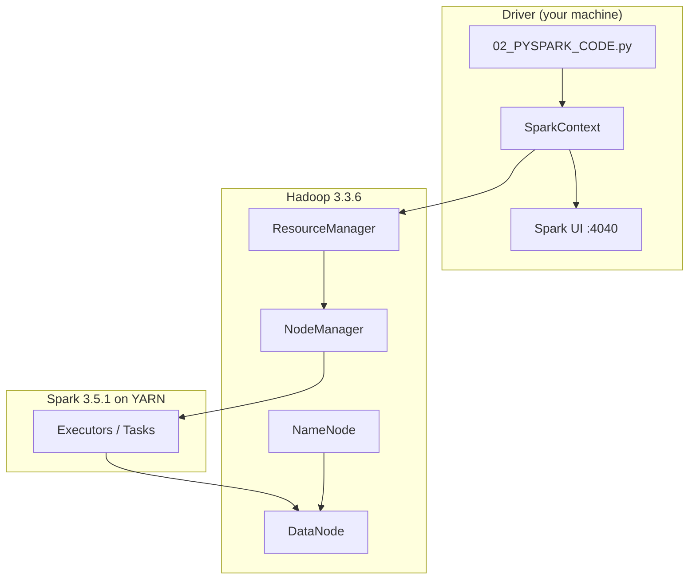
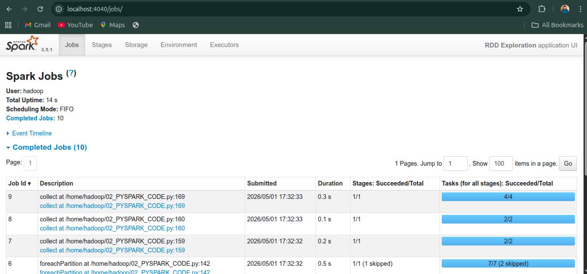
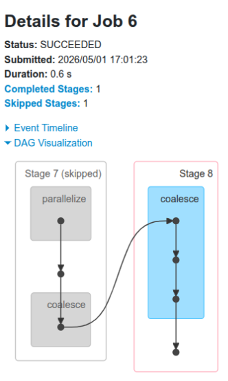
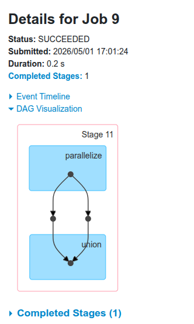

# Apache Spark RDD Exploration with Hadoop / YARN

**Muhammad Taha** · PySpark · Hadoop · Distributed Systems

I built this project to go beyond running Spark locally. The goal was simple: connect **Apache Spark 3.5.1** to an existing **Hadoop 3.3.6** stack (HDFS + YARN), run real RDD operations in PySpark, and learn how Spark actually schedules work — partitions, stages, shuffles, and the Spark UI.

If you want to reproduce this on your machine, everything you need is in this repo: setup commands, runnable Python code, and screenshots from my Spark UI runs.

---

## Table of Contents

- [What I Did](#what-i-did)
- [Why This Setup Matters](#why-this-setup-matters)
- [Architecture](#architecture)
- [Full Setup Guide](#full-setup-guide)
- [Run the Project](#run-the-project)
- [RDD Concepts I Explored](#rdd-concepts-i-explored)
- [Results From My Runs](#results-from-my-runs)
- [Spark UI & DAG Analysis](#spark-ui--dag-analysis)
- [Understanding Stages](#understanding-stages)
- [Quick Reference](#quick-reference)
- [Troubleshooting](#troubleshooting)
- [Project Structure](#project-structure)
- [Contact](#contact)

---

## What I Did

1. Installed Spark **without bundled Hadoop** and linked it to my existing Hadoop cluster
2. Configured environment variables, `spark-env.sh`, and `spark-defaults.conf` for **YARN**
3. Started HDFS and YARN services and verified them with `jps`
4. Wrote a PySpark script that exercises core RDD operations
5. Used the **Spark UI** (`http://localhost:4040`) to inspect jobs, durations, and DAG graphs
6. Documented what I learned so others can follow the same path

---

## Why This Setup Matters

Most beginners start with the pre-built Spark package that includes Hadoop. That works, but it does not teach you how Spark fits into a real cluster.

I chose `spark-3.5.1-bin-without-hadoop` because:

- It avoids duplicating Hadoop libraries already on the system
- It keeps Spark and Hadoop versions compatible
- It is closer to how teams deploy Spark on top of an existing data platform

The symbolic link (`ln -sf /opt/spark-3.5.1-bin-without-hadoop /opt/spark`) also makes future upgrades easier — you only update the link target.

---

## Architecture



| Component | Role in this project |
|-----------|----------------------|
| **HDFS** | Distributed storage layer (NameNode + DataNode) |
| **YARN** | Schedules Spark executors on cluster resources |
| **SparkContext** | Entry point — creates RDDs and submits jobs |
| **Spark UI** | Live dashboard for jobs, stages, tasks, and DAGs |

---

## Full Setup Guide

> Detailed steps are also in [`01_SETUP_COMMANDS.md`](01_SETUP_COMMANDS.md). Below is the complete flow I followed.

### Step 1 — Switch to the Hadoop user

All Spark and Hadoop services should run under the same user with proper HDFS/YARN permissions.

```bash
su hadoop
```

### Step 2 — Download Spark (without Hadoop)

```bash
cd /opt
sudo wget https://archive.apache.org/dist/spark/spark-3.5.1/spark-3.5.1-bin-without-hadoop.tgz
```

### Step 3 — Extract and set ownership

```bash
sudo tar xvzf spark-3.5.1-bin-without-hadoop.tgz -C /opt
sudo ln -sf /opt/spark-3.5.1-bin-without-hadoop /opt/spark
sudo chown -R hadoop:hadoop /opt/spark*
```

### Step 4 — Environment variables (`~/.bashrc`)

```bash
# Hadoop
export HADOOP_HOME=/home/hadoop/hadoop-3.3.6
export HADOOP_CONF_DIR=$HADOOP_HOME/etc/hadoop
export PATH=$PATH:$HADOOP_HOME/bin

# Spark + YARN
export YARN_CONF_DIR=$HADOOP_HOME/etc/hadoop
export SPARK_HOME=/opt/spark
export SPARK_DIST_CLASSPATH=$(hadoop classpath)
export PATH=$PATH:$SPARK_HOME/bin
export LD_LIBRARY_PATH=$HADOOP_HOME/lib/native:$LD_LIBRARY_PATH

# Python
export PYSPARK_PYTHON=/usr/bin/python3
```

Apply changes:

```bash
source ~/.bashrc
```

### Step 5 — Configure Spark for YARN

**`$SPARK_HOME/conf/spark-env.sh`**

```bash
export SPARK_DIST_CLASSPATH=$(hadoop classpath)
export JAVA_HOME=/usr/lib/jvm/java-11-openjdk-amd64
```

**`$SPARK_HOME/conf/spark-defaults.conf`**

```bash
spark.master yarn
```

### Step 6 — Start Hadoop and verify

```bash
$HADOOP_HOME/sbin/start-dfs.sh
$HADOOP_HOME/sbin/start-yarn.sh
sleep 10
jps
```

Expected processes:

```
NameNode
DataNode
ResourceManager
NodeManager
Jps
```

### Step 7 — Confirm variables

```bash
echo $HADOOP_HOME    # /home/hadoop/hadoop-3.3.6
echo $SPARK_HOME      # /opt/spark
echo $SPARK_DIST_CLASSPATH   # long classpath string
```

---

## Run the Project

### Option A — Submit the script (recommended)

```bash
# Local mode — good for learning and debugging
spark-submit --master local[2] 02_PYSPARK_CODE.py

# YARN mode — uses your Hadoop cluster manager
spark-submit --master yarn --deploy-mode client 02_PYSPARK_CODE.py
```

The script prints partition analysis to the terminal and keeps the Spark UI alive for **3 minutes** so you can open the browser and take screenshots.

### Option B — Interactive PySpark shell

```bash
# Local
pyspark --master local --driver-memory 2g

# YARN
pyspark --master yarn --driver-memory 2g --executor-memory 1g
```

### Spark UI

While the app is running, open:

**http://localhost:4040**

From `print(sc)` you will also see the UI URL in the terminal output.

---

## RDD Concepts I Explored

### SparkContext and RDD creation

```python
from pyspark import SparkConf, SparkContext

conf = SparkConf().setAppName("RDD Exploration")
sc = SparkContext(conf=conf)

x = [1, 2, 3, 4, 5, 6, 7, 8, 9, 10, 11, 12]
xRDD = sc.parallelize(x)
```

- `type(x)` → Python `list`
- `type(xRDD)` → `pyspark.rdd.RDD`
- API docs: https://spark.apache.org/docs/latest/api/python/reference/pyspark.rdd.RDD.html

### Transformations vs actions

Spark uses **lazy evaluation**. Transformations build a plan; actions trigger execution.

| Type | Examples | When it runs |
|------|----------|--------------|
| **Transformation** (lazy) | `map`, `filter`, `repartition`, `union`, `glom` | Builds DAG only |
| **Action** (eager) | `collect`, `count`, `foreachPartition` | Triggers computation |

### What `glom()` does

`glom()` converts each partition into a list. Instead of a flat RDD of elements, you get an RDD of arrays — one array per partition.

```python
xRDD = sc.parallelize([1, 2, 3, 4, 5, 6, 7, 8, 9, 10, 11, 12], 3)
print(xRDD.glom().collect())
# [[1, 2, 3, 4], [5, 6, 7, 8], [9, 10, 11, 12]]
```

I used `glom()` mainly for debugging — to see how data is actually split across partitions.

### Three ways to print an RDD

| Expression | Executes? | Output |
|------------|-----------|--------|
| `print(xRDD)` | No | `ParallelCollectionRDD[0] at parallelize at ...` |
| `print(xRDD.collect())` | Yes | `[1, 2, 3, ..., 12]` — flat list on driver |
| `print(xRDD.glom().collect())` | Yes | `[[...], [...]]` — preserves partition structure |

**Important:** `collect()` pulls all data to the driver. On large datasets this can cause out-of-memory errors. I only used it here on small test arrays.

### Filter and union

```python
xRDDEven = xRDD.filter(lambda y: y % 2 == 0)
xRDDOdd  = xRDD.filter(lambda y: y % 2 == 1)
xRDDUnion = xRDDEven.union(xRDDOdd)
```

`filter` is lazy. `union` combines two RDDs without removing duplicates. `collect()` on the union triggers the full DAG.

### Repartition and foreachPartition

```python
xRDD50 = sc.parallelize(list(range(1, 51)))
xRDD50_7 = xRDD50.repartition(7)

xRDD50_7.foreachPartition(lambda it: print(f"Partition: {list(it)}"))
```

`repartition(n)` causes a **shuffle** — data is redistributed across partitions. `foreachPartition` runs a function on each partition independently.

---

## Results From My Runs

### Default partitions (array of 50, `local[2]`)

```python
x50 = list(range(1, 51))
xRDD50 = sc.parallelize(x50)
print(xRDD50.getNumPartitions())  # 2
```

Partition layout I observed:

```
Partition 0: [1 .. 25]   (25 elements)
Partition 1: [26 .. 50]  (25 elements)
```

**What the default means:** In local mode, default partitions are tied to your configured parallelism (`local[2]` → 2 threads), not the array size. On a 4-core machine with `local[*]` you would typically see 4 partitions. In cluster mode, `spark.default.parallelism` drives this.

Check your CPU cores:

```bash
nproc
```

Rule of thumb I followed: **2–3× number of cores** is a reasonable partition count for many workloads.

### Repartition to 7 (50 elements)

After `xRDD50.repartition(7)`:

| Partition | Elements | Count |
|-----------|----------|-------|
| 0 | 36–45 | 10 |
| 1 | 46–50 | 5 |
| 2 | *(empty)* | 0 |
| 3 | 1–10 | 10 |
| 4 | 11–20 | 10 |
| 5 | 21–25 | 5 |
| 6 | 26–35 | 10 |

Total is still 50 elements. One empty partition after shuffle is normal — Spark redistributes by hash, not always evenly.

Approximate formula:

$$\text{elements per partition} = \left\lfloor \frac{N}{P} \right\rfloor \text{ or } \left\lceil \frac{N}{P} \right\rceil$$

### Partition execution order is not sequential

When I ran `foreachPartition`, the print order was:

```
1 → 0 → 3 → 4 → 5 → 6 → 2
```

Not `0, 1, 2, 3, 4, 5, 6`.

**Why:** Spark schedules partitions in parallel across available cores. The scheduler optimizes for throughput, not order. This order can change between runs.

**Takeaway:** Never write logic that depends on partition execution order. Use `sortByKey()` or similar if you need ordering.

---

## Spark UI & DAG Analysis

I profiled my jobs through the Spark UI. Here are the key results.

### Job timing (most expensive job)

| Field | Value |
|-------|-------|
| Job ID | 0 |
| Description | `parallelize` |
| Status | SUCCEEDED |
| Duration | **2.0 s** |

Other jobs from the same session for comparison:

| Job ID | Duration |
|--------|----------|
| 6 | 0.7 s |
| 9 | 0.5 s |
| 8 | 0.1 s |

### Screenshots

**Jobs overview — all completed jobs and durations**



**DAG for `foreachPartition` (Job 6, ~0.6 s)**

- Stage 7 (skipped): `parallelize → coalesce`
- Stage 8 (executed): `coalesce` before the action
- Skipped stages mean Spark reused part of an earlier computation plan



**DAG for `union` (Job 9, ~0.2 s)**

- Stage 11 executed
- Flow: `ParallelCollectionRDD → filter(even) + filter(odd) → UnionRDD → collect`



### Union DAG structure (text view)

```
ParallelCollectionRDD [1..12]
        |                    |
   filter(even)         filter(odd)
        |                    |
   FilteredRDD          FilteredRDD
             \            /
              \          /
                UnionRDD
                    |
                 collect()
```

### Partition-to-machine mapping (local mode)

In my local runs, all partitions ran on:

- **Executor ID 0** (driver node)
- **Host:** `localhost`

In a multi-node YARN cluster, check the **Executors** tab in Spark UI to see which host runs each task.

---

## Understanding Stages

A **stage** is a set of tasks Spark can run in parallel **without a shuffle**.

| Property | Meaning |
|----------|---------|
| Parallel tasks | All tasks in one stage can run at the same time |
| No shuffle inside | Data does not move between partitions mid-stage |
| Sequential stages | Stage 1 starts after Stage 0 finishes |

**New stages are created when a shuffle happens:**

- `repartition()`
- `groupByKey()`
- `reduceByKey()`
- `join()`

**Stage numbering:** Stages are numbered sequentially — Stage 0, Stage 1, Stage 2, … — increasing at each shuffle boundary.

**Example with union:**

```
Stage 0: filter even and odd (no shuffle)
Stage 1: union + collect (shuffle boundary may appear depending on lineage)
```

**Performance note I learned:** More stages usually means more shuffles, which means more network I/O. Fewer shuffles → faster jobs when possible.

---

## Quick Reference

| Command | What it does |
|---------|--------------|
| `sc.parallelize(x)` | Create RDD from a local collection |
| `rdd.getNumPartitions()` | Return partition count |
| `rdd.glom().collect()` | Show partition contents as nested lists |
| `rdd.repartition(n)` | Change partition count (triggers shuffle) |
| `rdd.filter(func)` | Keep elements matching a condition |
| `rdd.map(func)` | Transform each element |
| `rdd.union(other)` | Combine two RDDs |
| `rdd.collect()` | Bring all data to driver (use carefully) |
| `rdd.foreachPartition(func)` | Apply function per partition |
| `rdd.count()` | Count elements (action) |

### Setup checklist

- [ ] Spark 3.5.1 extracted to `/opt/spark`
- [ ] `~/.bashrc` has `HADOOP_HOME`, `SPARK_HOME`, `SPARK_DIST_CLASSPATH`
- [ ] `spark-env.sh` configured with `JAVA_HOME` and classpath
- [ ] `spark-defaults.conf` has `spark.master yarn`
- [ ] `jps` shows NameNode, DataNode, ResourceManager, NodeManager
- [ ] `pyspark` or `spark-submit` runs without errors
- [ ] Spark UI opens at `http://localhost:4040`

---

## Troubleshooting

| Problem | What to try |
|---------|-------------|
| `hadoop: command not found` | `echo $HADOOP_HOME` — set it in `~/.bashrc` and `source` |
| PySpark won't start | Check Java: `java -version`. Install: `sudo apt install openjdk-11-jdk` |
| Hadoop services missing | Run `start-dfs.sh` and `start-yarn.sh`, wait 10s, then `jps` |
| Spark UI not loading | App must be running. Try `http://127.0.0.1:4040`. Check firewall: `sudo ufw allow 4040` |
| Python errors | `export PYSPARK_PYTHON=/usr/bin/python3` |
| Classpath issues | `export SPARK_DIST_CLASSPATH=$(hadoop classpath)` in both `.bashrc` and `spark-env.sh` |

**Stop all services when done:**

```bash
$HADOOP_HOME/sbin/stop-yarn.sh
$HADOOP_HOME/sbin/stop-dfs.sh
```

---

## Project Structure

```
.
├── README.md                 # Full documentation (you are here)
├── 01_SETUP_COMMANDS.md      # Copy-paste setup commands
├── 02_PYSPARK_CODE.py        # Runnable RDD exploration script
├── images/
│   ├── spark-ui-dashboard.png
│   ├── spark-dag-foreachpartition.png
│   └── spark-dag-union.png
└── .gitignore
```

This is everything needed to clone the repo and reproduce the work. No extra build files or course materials.

---

## What I Learned (honest summary)

I went into this wanting to understand RDDs on paper. Coming out, I can:

- Wire Spark to an existing Hadoop/YARN cluster from scratch
- Read partition layouts and know when a shuffle is happening
- Use the Spark UI to debug slow jobs instead of guessing
- Explain why `collect()` is dangerous on big data

I am still learning — DataFrames, Spark SQL, and HDFS file I/O are natural next steps for me. But this project gave me a solid foundation in how Spark thinks about distributed computation.

---

## Contact

**Muhammad Taha**

- Mail: *bolt.taha.work@gmail.com*
- LinkedIn: *https://www.linkedin.com/in/muhammad-taha-57713b247/?skipRedirect=true*

If something in the setup does not work on your machine, open an issue or reach out — happy to help.

---

*Apache Spark 3.5 · Hadoop 3.3.6 · PySpark · YARN*
